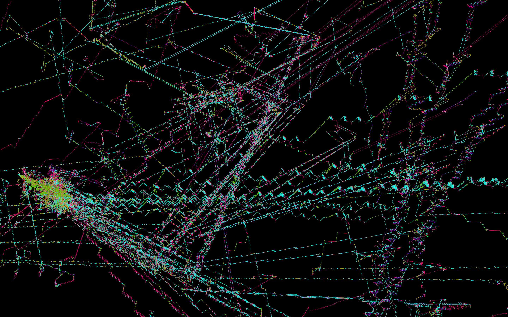

# Mutautomata
This is a pattern generator based on a random set of instructions, which are manipulated in small ways and drawn several times.
The plots this program makes are three-dimensional, and can optionally be displayed for VR.

```sh
cargo run --release -- --help
```



